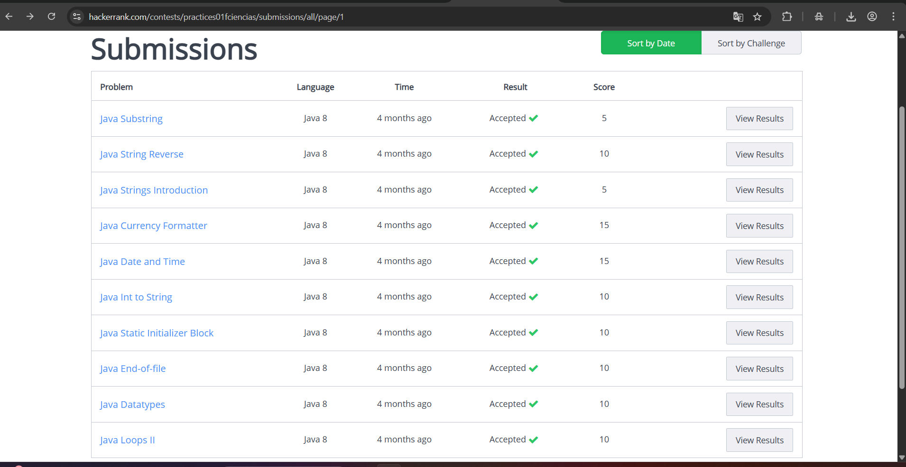
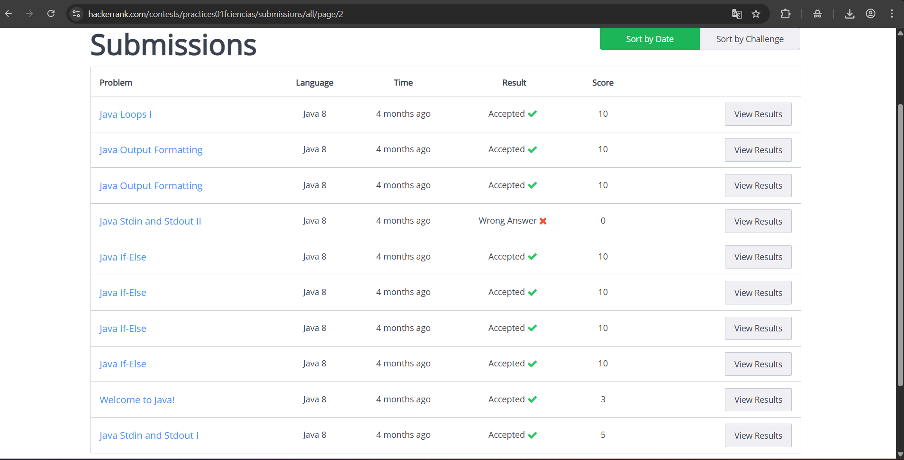
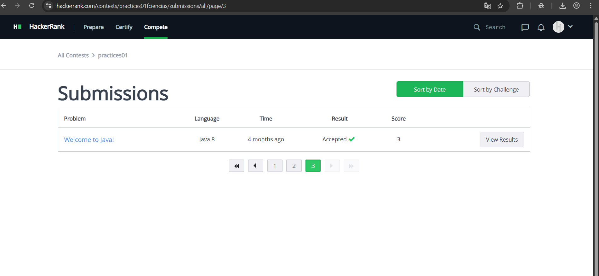

# Practica 01: Ejercicios de Programación en Java (HackerRank)

## ✅ Objetivo

El objetivo es poner en práctica los conceptos básicos de la programación orientada a objetos. Resolviendo ejercicios simples usando clases, objetos y métodos propuestos en la plataforma HackerRank.

## ✍️ Descripción

En HackerRank cada desafío tiene una puntuación predeterminada. La puntuación de un participante depende de la cantidad de casos de prueba que el envío del código de un participante pasa con éxito.
Si un participante envía más de una solución por desafío, la puntuación del participante reflejará la puntuación más alta obtenida.

Se pusieron en practica los siguientes temas:

* Manejo de entrada y salida (`Java Stdin and Stdout I/II`).
* Estructuras condicionales (`Java If-Else`).
* Bucles (`Java Loops I/II`).
* Manejo de tipos de datos y conversión (`Java Datatypes`, `Java Int to String`).
* Operaciones con cadenas (`Java String Reverse`, `Java Substring`).
* Formato de salida (`Java Output Formatting`).

La gran mayoría de las soluciones se encuentran con el estado **Accepted** en la plataforma.

## ⚙️ Tecnologías utilizadas

* **Lenguaje:** Java 8.
* **Plataforma de Evaluación:** HackerRank.

## 📸 Evidencias (Capturas de pantalla)
[**Nota:** Estas imágenes fueron subidas a la raíz del repositorio, así como también la carpeta src con los 16 ejercicios de Hacker Rank.]

### Resultados de Submissions

* **Envíos Aceptados (Substring, Loops, etc.):**
   
* **Envíos Aceptados (If-Else, Stdin/Stdout, etc.):** 
   
* **Envíos Aceptados (Welcome to Java!):**
* 
  
## 📁 Soluciones (Archivos .java)

El código fuente de los 16 problemas está organizado por paquetes y se puede revisar directamente en la carpeta [src/](https://github.com/valeriagh-star/Practica-01-HackerRank/tree/main/src/).

| Problema de HackerRank | Ruta del Archivo .java | Estado |
| :--- | :--- | :--- |
| **Welcome to Java!** | [src/WelcomeToJava/Solution.java](https://github.com/valeriagh-star/Practica-01-HackerRank/blob/main/src/WelcomeToJava/Solution.java) | Accepted |
| **Java Stdin and Stdout I** | [src/javaStdinAndStdoutI/Solution.java](https://github.com/valeriagh-star/Practica-01-HackerRank/blob/main/src/javaStdinAndStdoutI/Solution.java) | Accepted |
| **Java Stdin and Stdout II** | [src/javaStdinAndStdoutII/Solution.java](https://github.com/valeriagh-star/Practica-01-HackerRank/blob/main/src/javaStdinAndStdoutII/Solution.java) | Wrong Answer |
| **Java If-Else** | [src/javaIfElse/Solution.java](https://github.com/valeriagh-star/Practica-01-HackerRank/blob/main/src/javaIfElse/Solution.java) | Accepted |
| **Java Loops I** | [src/javaLoopsI/Solution.java](https://github.com/valeriagh-star/Practica-01-HackerRank/blob/main/src/javaLoopsI/Solution.java) | Accepted |
| **Java Loops II** | [src/javaLoopsII/Solution.java](https://github.com/valeriagh-star/Practica-01-HackerRank/blob/main/src/javaLoopsII/Solution.java) | Accepted |
| **Java Output Formatting** | [src/javaOutputFormatting/Solution.java](https://github.com/valeriagh-star/Practica-01-HackerRank/blob/main/src/javaOutputFormatting/Solution.java) | Accepted |
| **Java Datatypes** | [src/javaDataTypes/Solution.java](https://github.com/valeriagh-star/Practica-01-HackerRank/blob/main/src/javaDataTypes/Solution.java) | Accepted |
| **Java End-of-file** | [src/javaEndOfFile/Solution.java](https://github.com/valeriagh-star/Practica-01-HackerRank/blob/main/src/javaEndOfFile/Solution.java) | Accepted |
| **Java Static Initializer Block** | [src/javaStaticInitializerBlock/Solution.java](https://github.com/valeriagh-star/Practica-01-HackerRank/blob/main/src/javaStaticInitializerBlock/Solution.java) | Accepted |
| **Java Int to String** | [src/javaIntToString/Solution.java](https://github.com/valeriagh-star/Practica-01-HackerRank/blob/main/src/javaIntToString/Solution.java) | Accepted |
| **Java Date and Time** | [src/javaDateAndTime/Result.java](https://github.com/valeriagh-star/Practica-01-HackerRank/blob/main/src/javaDateAndTime/Result.java) | Accepted |
| **Java Currency Formatter** | [src/javaCurrencyFormatter/Solution.java](https://github.com/valeriagh-star/Practica-01-HackerRank/blob/main/src/javaCurrencyFormatter/Solution.java) | Accepted |
| **Java Strings Introduction** | [src/javaStringsIntroduction/Solution.java](https://github.com/valeriagh-star/Practica-01-HackerRank/blob/main/src/javaStringsIntroduction/Solution.java) | Accepted |
| **Java Substring** | [src/javaSubstring/Solution.java](https://github.com/valeriagh-star/Practica-01-HackerRank/blob/main/src/javaSubstring/Solution.java) | Accepted |
| **Java String Reverse** | [src/javaStringReverse/Solution.java](https://github.com/valeriagh-star/Practica-01-HackerRank/blob/main/src/javaStringReverse/Solution.java) | Accepted |

## ▶️ Instrucciones de ejecución

Dado que esta práctica consiste en soluciones enviadas a una plataforma en línea, la ejecución es directa:
1.  **Clonar el repositorio.**
2.  **Revisar el Código:** El código fuente de cada problema (`.java`) está incluido. Puedes abrir y revisar las soluciones en cualquier IDE de Java (como IntelliJ o Eclipse).
3.  **Ejecutar (Opcional):** Para probar una solución localmente, copia la clase principal (`class Solution`) a tu IDE y ejecuta el método `main()`, proporcionando la entrada de datos por la consola.

